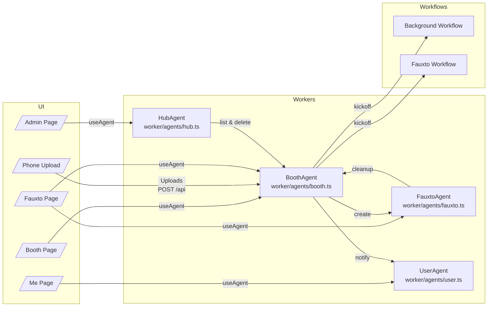

# Fauxto Booth

Fauxto Booth is a Cloudflare-native photo kiosk that lets guests snap a selfie, drop it into a booth-specific flow, and watch an AI composite appear moments later. The lobby, booth controls, guest upload flow, and Fauxto detail pages are all rendered with a Vite + React frontend, while booth automation runs inside Cloudflare Workers powered by the Agents SDK and Workflows.

## Architecture at a glance

- **Vite/React kiosk UI** – All client code lives in `src/`. The root router (`src/App.tsx`) swaps between the lobby, booth host dashboard, `/me` personal hub, `/admin`, and `/fauxtos/:id`.
- **Cloudflare Workers** – The worker entry in `worker/index.ts` exposes API routes and binds agents/workflows declared in `worker/agents/` and `worker/workflows/`.
- **Agents SDK** – Durable booth, user, hub, and Fauxto agents encapsulate state and RPCs (`worker/agents/*.ts`). UI surfaces subscribe to these agents with `useAgent` for live updates.
- **Workflows** – Orchestration for background refreshes and Fauxto generation lives under `worker/workflows/`, letting booth agents kick off long running jobs without blocking requests.
- **Assets** – Guest uploads, background renders, and final Fauxtos are written to the `Photos` R2 bucket via the worker bindings defined in `wrangler.jsonc`.



## AI model

Fauxto Booth currently composites images with [ByteDance’s SeeDream 4.5 model on Replicate](https://replicate.com/bytedance/seedream-4.5). The booth agent assembles the booth background plus member uploads and calls Replicate’s `bytedance/seedream-4.5` image editing endpoint to produce the finished Fauxto.

## Local development

### Prerequisites

- Node.js 20+ and npm
- Cloudflare `wrangler` CLI (optional for deploy previews, but useful for type generation)
- A Replicate API token in your environment (`REPLICATE_API_TOKEN`)

### Getting started

```bash
npm install          # install dependencies once
npm run dev          # start the Vite dev server (UI + worker proxy)
```

The dev server serves the kiosk UI at `http://localhost:5173/` and proxies `/api/*` requests to the worker entry generated by Vite.

Before running, copy the sample secrets file and fill in your values:

```bash
cp .dev.vars.example .dev.vars
```

### Helpful scripts

| Command | Purpose |
| --- | --- |
| `npm run dev` | Run Vite with the worker entry in development mode. |
| `npm run lint` | Type-aware ESLint (TypeScript + React Hooks rules). Must be clean before committing. |
| `npm run build` | Production build for both the React app and the worker bundle. |
| `npm run xbuild` | Same as build, but runs TypeScript project references for stricter checks. |
| `npm run preview` | Serve the production Vite build locally. |
| `npm run cf-typegen` | Refresh Cloudflare binding types after editing KV, R2, DO, or service bindings. |

## Deployment

Deployment goes through Wrangler. Once you have access to the Cloudflare account (and the necessary environment variables configured), run:

```bash
npm run deploy
```

That script calls `wrangler deploy`, uploading both the worker and the static assets. Make sure you:

1. Built the project (`npm run build`) so the worker reflects the latest code.
2. Exported any required secrets (Replicate token, etc.) via `wrangler secret put`.
   - To mirror your local `.dev.vars`, you can bulk upload secrets with `npx wrangler secret bulk .dev.vars`.
3. Regenerated binding types (`npm run cf-typegen`) if you touched worker bindings.

## Cloudflare tunnel for dev uploads

When testing Fauxto generation locally, Replicate needs to reach the dev server to fetch the uploaded images. Run a Cloudflare tunnel, grab the issued `*.trycloudflare.com` host, and allow it in Vite:

1. Install `cloudflared` (e.g. `brew install cloudflare/cloudflare/cloudflared` on macOS or grab a binary from the [Cloudflare Downloads](https://developers.cloudflare.com/cloudflare-one/connections/connect-networks/downloads/) page).
2. Start a tunnel (e.g. `cloudflared tunnel --url http://localhost:5173`) and copy the public host.
2. Update `vite.config.ts` `server.allowedHosts` to include that host while developing:
   ```ts
   server: {
     allowedHosts: ["your-tunnel-name.trycloudflare.com"],
   }
   ```
3. Restart `npm run dev` so the host check picks up the new value.

This keeps dev traffic flowing through the tunnel so Replicate can fetch the uploaded images during the transform step.

## Agents SDK and Workflows

- **BoothAgent** (`worker/agents/booth.ts`) owns booth metadata, uploads, the Fauxto queue, and exposes callables like `refreshBackground`, `setIdealMemberSize`, and `hasUserUpload`.
- **FauxtoAgent** (`worker/agents/fauxto.ts`) tracks a single generated Fauxto and handles cleanup (R2 deletion, notifying members, updating booth state).
- **UserAgent** (`worker/agents/user.ts`) maintains each guest’s Fauxto history plus the booths they’ve uploaded to, powering `/me`.
- **HubAgent** (`worker/agents/hub.ts`) lists every booth, aggregates Fauxtos for moderation, and handles admin deletions.
- **Workflows** (`worker/workflows/`) coordinate background regeneration and Fauxto generation, allowing agents to schedule durable work through Cloudflare’s Workflows runtime.

All agents are authored with the [Cloudflare Agents SDK](https://developers.cloudflare.com/workers/agents/) and accessed client-side through `useAgent` helpers (`agents/react`). Cloudflare Workflows are configured in `worker/workflows/` and triggered from agents via `this.env.<WorkflowName>.create(...)`.

## Running the full experience

1. `npm install`
2. `npm run dev`
3. Visit `http://localhost:5173/` to spin up a booth, share `/booths/:slug/phone` on your device, and watch Fauxtos appear in `/me`, `/admin`, and `/fauxtos/:id`.

When you’re ready for production, run `npm run build && npm run deploy` and share the generated URLs. Have fun making Fauxtos that never happened!

## License

This project is licensed under the MIT License. See `LICENSE` for details.
 
